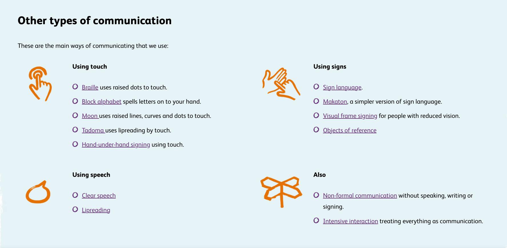

# Research on Deafblind Communication Tools

This project focuses on the development and sharing of innovative communication tools designed for the deafblind community. 

This week, I concentrated on researching the most effective communication methods and technologies.

## Communication Methods

Deafblind individuals use a variety of communication methods based on their specific sensory capabilities. Below are some of the primary methods identified through academic research:

### Tactile Methods

1. **Tactile Sign Language**:
   - **How it works**: Tactile Sign Language is adapted from visual sign languages for tactile reception. Deafblind individuals place their hands over the signer's hands to feel the movements and shapes of signs. This method enables them to perceive the gestures through physical contact, facilitating communication through touch.
   - **Relevant research**: For a deeper understanding, see the detailed exploration in ["Tactile signing"](https://www.ndcs.org.uk/information-and-support/language-and-communication/sign-language/tactile-signing/#:~:text=Tactile%20signing%20is%20a%20method,communicated%20through%20touch%20and%20movement.).

2. **Deafblind Manual Alphabet**:
   - **How it works**: This method involves spelling out letters onto the palm of the deafblind person's hand using hand signs for each letter of the alphabet. The tactile feedback allows the deafblind person to 'feel' the words being communicated.
   - **Relevant research**: While specific studies focusing solely on the Deafblind Manual Alphabet are rare, this communication method is often included in broader discussions on tactile communication strategies for the deafblind.

3. **Braille**:
   - **How it works**: Braille is a tactile writing system that uses combinations of raised dots to represent letters, numbers, and punctuation. Deafblind individuals read Braille by moving their fingers across these dots, enabling them to access written communication independently.
   - **Relevant research**: Braille's application in supporting deafblind communication is well documented. For comprehensive studies on Braille technology and education, you can refer to works like those by Romero-Rey & Herrera. More information can also be found through resources provided by organizations such as the [National Federation of the Blind](https://nfb.org/).

These tactile methods are essential for enabling effective communication and enhancing the independence of deafblind individuals. Each method provides unique advantages tailored to individual needs and remaining sensory capabilities.

### Technological Aids
- **Refreshable Braille Displays**: These devices convert text from digital devices into braille for tactile reading. [Romero-Rey & Herrera, "Technological Aids for the Deafblind"]
- **Screen Readers**: Software that vocalizes text displayed on a computer screen.

### Hybrid Methods
- **Speech and Lip-reading**: Utilized by those who have retained partial hearing and vision.
- **Print on Palm**: Involves writing words directly on the palm.
- **Visual Frame Signing**: Signing within the limited visual field of the individual.

## Tools and Technologies

This section outlines tools and technologies that support communication for the deafblind community:

- **Braille Displays**
- **Assistive Apps**: Designed to convert speech to text or braille and vice versa.
- **Vibratory Alert Devices**: Use vibrations to convey messages or alerts.

## Key Research Papers

Here are several key research papers that provide foundational knowledge and insights into the development of communication tools for deafblind individuals:

1. **Tactile Signing**: Discusses methods of tactile communication. [Access here](https://www.ndcs.org.uk/information-and-support/language-and-communication/sign-language/tactile-signing/#:~:text=Tactile%20signing%20is%20a%20method,communicated%20through%20touch%20and%20movement.)

